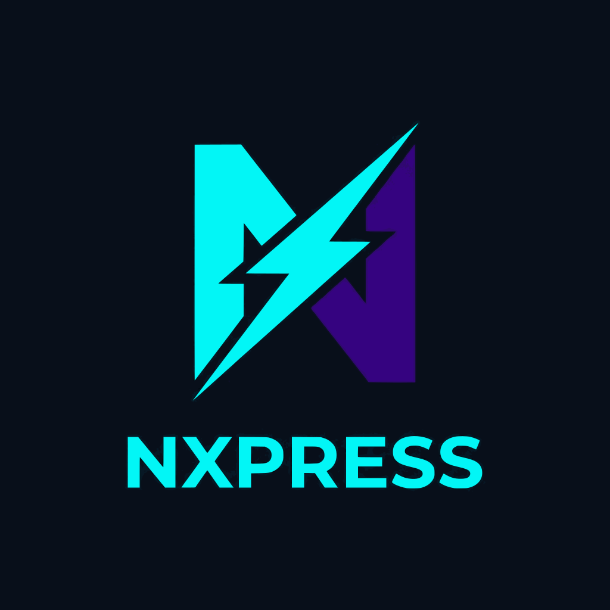

<div align="center">
  
  <h1>Nxpress</h1>
  <p><strong>Express.js framework with file-based routing and Next.js-like DX</strong></p>

[](https://www.npmjs.com/package/@nxpress/core)
[](https://nxpress.netlify.app/)
[](https://opensource.org/licenses/MIT)

\
 [**Read the Official Documentation**](https://nxpress.netlify.app/)

</div>

---

## Quick Start

Scaffold a new project in seconds:

```bash
npx create-nxpress-app
```

Or install `@nxpress/core` in an existing project:

```bash
pnpm add @nxpress/core
```

Start the development server:

```bash
npx nxpress dev
```

Or use your main server.ts file :

```bash
npx tsx --watch server.ts
```

---

## Documentation

For full documentation and guide, visit **[the official docs](https://nxpress.netlify.app/)**.
